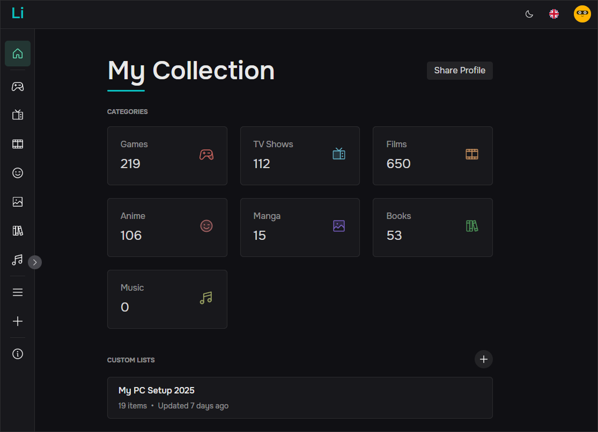

# <p align="center">Listify</p>

<p align="center">
  <strong>Ваша личная коллекция медиа. Всегда доступна, полностью ваша.</strong>
</p>

<p align="center">
  
</p>

<p align="center">
  <a href="README.md"> English</a> | <strong> Русский</strong>
</p>

<p align="center">
  
  
  
  
  
  
  
</p>

---

## 🎯 Что это такое?

**Listify** — это стильный, современный трекер медиа, созданный для тех, кто хочет держать свои коллекции в порядке без лишнего социального шума и рекламы. Независимо от того, ведете ли вы учет игр, фильмов, книг или чего-то еще, Listify предоставляет простой и удобный интерфейс для управления вашей личной библиотекой.

Разработанный с нуля как преемник [Nightlist](https://github.com/nightrunner91/nightlist), он использует **Vue 3**, **Fastify** и **PostgreSQL** для обеспечения быстрого, безопасного и легко настраиваемого опыта.

- 📝 **Создавайте списки и управляйте ими** — организуйте игры, фильмы, книги и многое другое.
- 🔗 **Делитесь своими коллекциями** — персональные публичные профили для вашей библиотеки.
- 💾 **Владейте своими данными** — полная возможность экспорта и импорта, никакой привязки к платформе.
- 🚀 **Невероятно быстро** — оптимизировано для производительности с использованием современного технологического стека.
- 🔒 **Конфиденциальность прежде всего** — никакой рекламы, никаких трекеров, полностью ваше.

## 🚀 Основные особенности

- ✨ **Интуитивно понятный интерфейс** — легкий дизайн на базе Naive UI.

- 💾 **Сохранность данных** — импортируйте и экспортируйте свою коллекцию в любое время.

- 🛡️ **Приватность** — никакого отслеживания, рекламы или передачи данных третьим лицам.

- ⚡ **Высокая производительность** — оптимизированный Vue 3 / Vite и легкий бэкенд на Fastify.

- 🏗️ **Открытый исходный код** — изучайте, создавайте форки или хостите проект самостоятельно.

- 🌍 **Многоязычная поддержка** — EN, DE, ES, FR, PL, RO, RU, UK.

## 🛠️ Технологический стек

| Компонент | Технология | Описание |
| :--- | :--- | :--- |
| **Frontend** | [Vue 3](https://vuejs.org/) | Composition API и Script Setup |
| **Backend** | [Fastify](https://fastify.dev/) | Высокопроизводительный фреймворк для Node.js |
| **Database** | [PostgreSQL](https://www.postgresql.org/) | Реляционная база данных через [Drizzle ORM](https://orm.drizzle.team/) |
| **Styling** | [Naive UI](https://www.naiveui.com/) | Кураторская библиотека компонентов и дизайн-система |
| **State** | [Pinia](https://pinia.vuejs.org/) | Современное управление состоянием для Vue |
| **Build** | [Vite](https://vitejs.dev/) | Инструментарий для фронтенда следующего поколения |

## 📡 Внешние источники данных

Listify интегрируется с несколькими высококачественными внешними API для обеспечения мгновенного автодополнения и получения богатых метаданных для ваших коллекций:

- 🎮 **[RAWG API](https://rawg.io/apidocs)**: основной источник для категории **Игры**.
- 🎬 **[TMDB API](https://www.themoviedb.org/documentation/api)**: обеспечивает поиск для **Фильмов** и **Сериалов**.
- 📖 **[Jikan API](https://jikan.moe/)**: бесплатный API с открытым исходным кодом для базы данных MyAnimeList, используется для **Аниме** и **Манги**.
- 🎵 **[iTunes API](https://developer.apple.com/library/archive/documentation/AudioVideo/Conceptual/iTuneSearchAPI/index.html)**: предоставляет надежный каталог для **Книг** и **Музыки**.

> [!IMPORTANT]
> Некоторые провайдеры (RAWG, TMDB) требуют API-ключ. Если вы хостите приложение самостоятельно, убедитесь, что они правильно настроены в вашем файле `api/.env` для работы функций автодополнения.

## 🏁 С чего начать

### Требования

- **Node.js** >= 20.0.0
- **npm** >= 9.0.0
- **PostgreSQL** (запущенный локально или через Docker)

### 1. Клонирование и установка

```bash
git clone https://github.com/nightrunner91/listify.git
cd listify
npm install
cd api && npm install && cd ..
```

### 2. Настройка окружения

Создайте файл `.env` в директории `api/`:

```bash
cp api/.env.example api/.env
```

Отредактируйте `api/.env`, указав учетные данные вашей базы данных и секретные ключи.

### 3. Миграция базы данных

```bash
cd api
npm run db:generate
npm run db:migrate
```

### 4. Запуск серверов разработки

**Фронтенд:**
```bash
npm run dev
```

**Бэкенд:**
```bash
cd api
npm run dev
npm run db:studio
```

## 🏗️ Структура проекта

```text
.
├── api/                    # Бэкенд (Node.js + Fastify)
│   ├── src/
│   │   ├── db/             # Соединение с БД и схемы Drizzle
│   │   ├── routes/         # API эндпоинты (Auth, Records, Lists)
│   │   ├── plugins/        # Плагины Fastify (i18n, Rate limit и др.)
│   │   ├── middleware/     # Кастомные хуки Fastify
│   │   ├── services/       # Слой бизнес-логики
│   │   └── app.js          # Настройка приложения Fastify
│   └── drizzle/            # Файлы миграций SQL
│
├── src/                    # Фронтенд (Vue 3 + Vite)
│   ├── api/                # Конфигурация API-клиента
│   ├── components/         # Переиспользуемые UI-компоненты
│   ├── features/           # Компоненты и логика на основе фич
│   ├── i18n/               # Файлы локализации
│   ├── router/             # Конфигурация Vue Router
│   ├── stores/             # Управление состоянием Pinia
│   ├── views/              # Основные страницы приложения
│   └── theme.config.js     # Переопределения темы Naive UI
├── public/                 # Статические ресурсы и фавикон
└── package.json            # Корневые скрипты и зависимости
```

## 🤝 Участие в разработке

Вклад в проект — это то, что делает сообщество open-source таким удивительным местом для обучения, вдохновения и творчества. Любой ваш вклад **очень ценится**.

1. Сделайте форк проекта
2. Создайте свою ветку фичи (`git checkout -b feature/AmazingFeature`)
3. Зафиксируйте свои изменения (`git commit -m 'Add some AmazingFeature'`)
4. Отправьте изменения в ветку (`git push origin feature/AmazingFeature`)
5. Откройте Pull Request

## 📄 Лицензия

Распространяется под лицензией MIT. Смотрите `LICENSE` для получения дополнительной информации.

---

<p align="center">
  Сделано с ❤️ разработчиком <a href="https://t.me/nightrunner91">nightrunner91</a>
</p>
